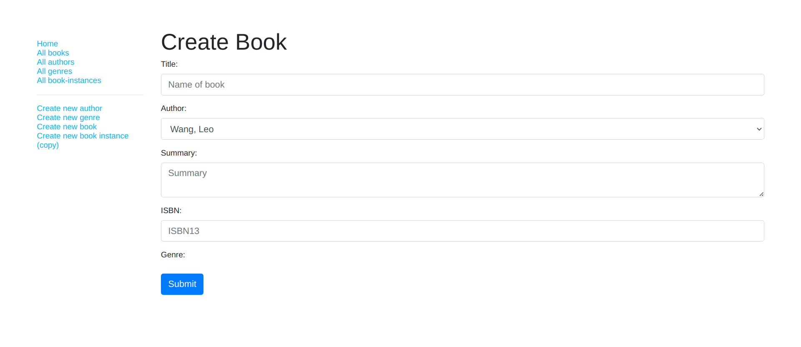
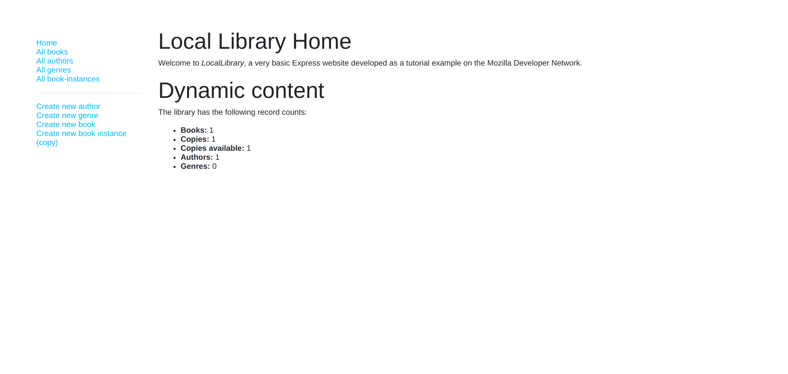
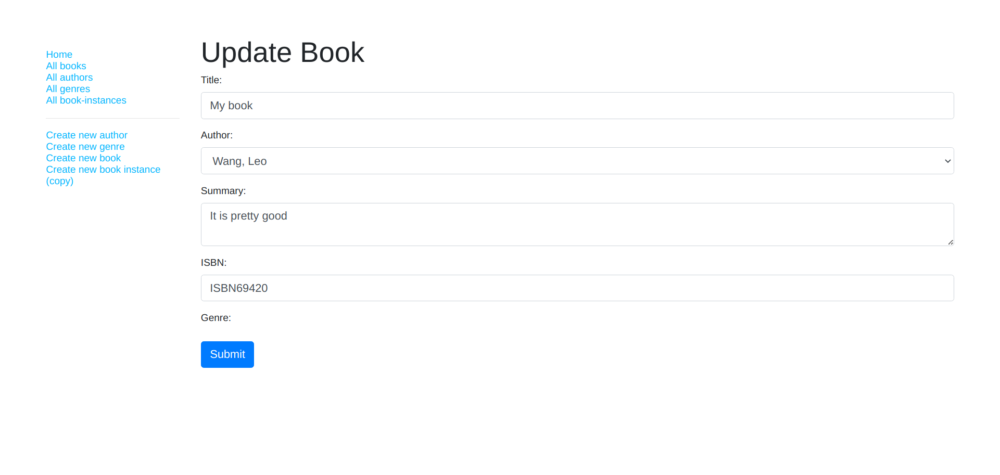

# mdn-express-library
A library website made by following MDN tutorial, allowing user to CRUD the database .Made with Express.js.

The data contains author, book, copies, and genre.You can create, read, update and delete them.

It's basically a practice for CRUD operations in JavaScript.
# Details
- Made with Express.js
- Use MongoDB for database
- Deployed with Railway
# Credits
[MDN local library tutorial(Overview)](https://developer.mozilla.org/en-US/docs/Learn/Server-side/Express_Nodejs/Tutorial_local_library_website)

Most of the code is written by MDN, I only wrote some of them (delete book, copies, genre, some pug templates).

# Results
## C - Create books

---
## R - Read all data

---
## U - Update books

---
## D - Delete author

---
# Link
[Live Preview](https://mdn-express-library-ascodeasice.up.railway.app/catalog)

NOTE: deploying on railway has a time limit, so you might not be able to see it live preview 